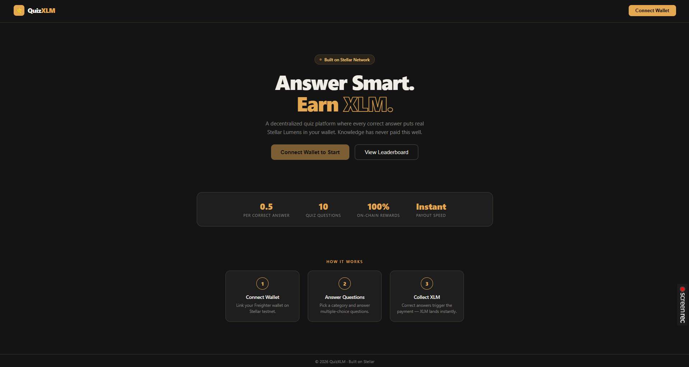
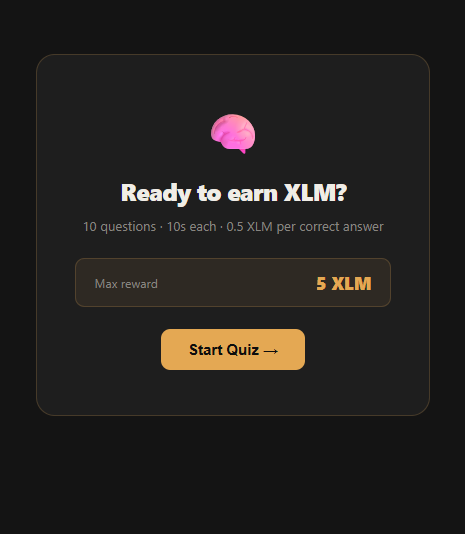
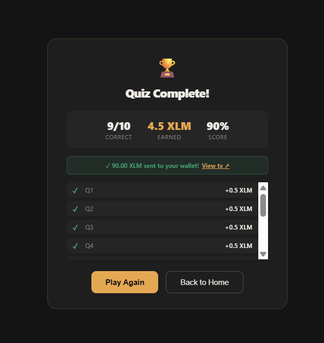
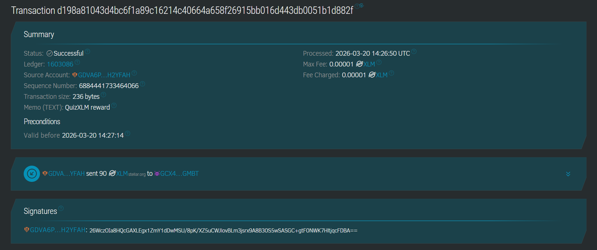

# 🌟 QuizXLM — Earn Stellar Rewards by Answering Questions
 
A decentralized quiz application built on the **Stellar Network** where users answer multiple-choice questions and earn real **XLM (Stellar Lumens)** for every correct answer.
---

## 🔗 Live Demo
 
👉 https://mini-dapp-quiz-xlm.vercel.app/
---

## 📸 Screenshots
 
### 1. Landing Page

 
### 2. Quiz Screen

 
### 3. Result Screen


### 4. Transaction on Stellar Network

---

## ✨ Features
 
- **1. Wallet Connection** — Connect/disconnect mock Freighter wallet with public key display and XLM balance

- **2. Multiple Choice Quiz** — 10 questions across Blockchain, Stellar, and Crypto categories

- **3. Countdown Timer** — 15 seconds per question with a live progress bar

- **4. Instant XLM Rewards** — Correct answers trigger an automatic XLM payment via Stellar SDK

- **5. Score Tracking** — Live score and earned XLM displayed during quiz

- **6. Result Screen** — Final score, XLM earned, per-question breakdown, and transaction link

- **7. Leaderboard** — Top 10 players ranked by XLM earned stored in localStorage

- **8. Stellar Explorer Link** — Every reward transaction is viewable on Stellar Expert
---

## 🛠️ Tech Stack
 
| Technology | Purpose |
|---|---|
| React + Vite | Frontend framework |
| @stellar/stellar-sdk | Stellar network interaction & XLM payments |
| Stellar Testnet (Horizon) | Blockchain network for transactions |
| Freighter Wallet | Stellar wallet integration |
| localStorage | Leaderboard score persistence |
| Vercel | Deployment & hosting |
---

### Installation
 
**1. Clone the repository:**
```bash
git clone https://github.com/YOUR_USERNAME/quiz-xlm.git
cd quiz-xlm
```
 
**2. Create `.env` file in the project root:**
```env
VITE_ADMIN_SECRET=YOUR_STELLAR_TESTNET_SECRET_KEY
VITE_ADMIN_PUBLIC=YOUR_STELLAR_TESTNET_PUBLIC_KEY
```
 
**3. Fund your admin account on Stellar Testnet:**
 
Open this URL in your browser (replace with your public key):
```
https://friendbot.stellar.org/?addr=YOUR_PUBLIC_KEY
```
This gives your admin account 10,000 free testnet XLM to pay out rewards.
---

## 🧪 Tests
 
### Test Cases
 
| # | Test | Description |
|---|---|---|
| 1 | Reward calculation | Verifies correct XLM amount per answer (0.5 XLM × correct answers) |
| 2 | Zero score | Confirms no reward is sent when score is 0 |
| 3 | Score saving | Checks leaderboard correctly saves and ranks scores |
---

## 🌐 Deployment
 
This app is deployed on **Vercel**.

### Deploy your own
 
1. Push code to GitHub
2. Go to [vercel.com](https://vercel.com) and import your repository
3. Add environment variables in Vercel dashboard:
   - `VITE_ADMIN_SECRET`
   - `VITE_ADMIN_PUBLIC`
4. Click Deploy